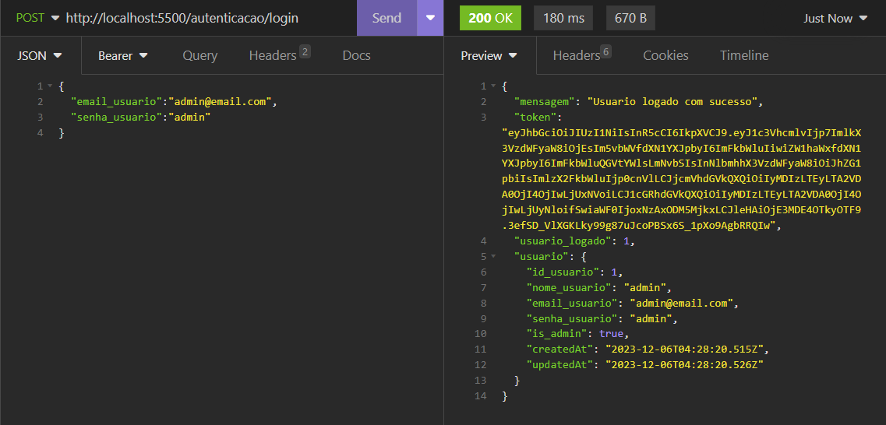
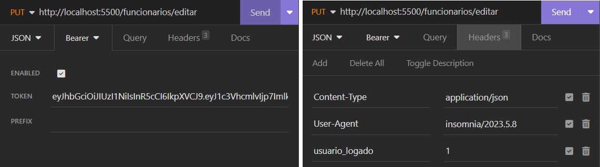
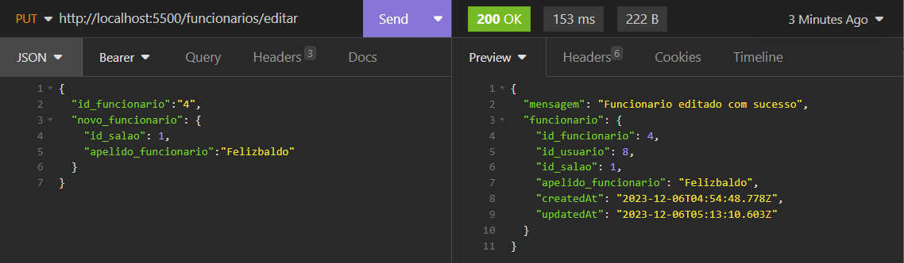

# API PARA GERENCIAMENTO DE AGENDAMENTOS NO SALÃO DE BELEZA

## INSTRUÇÕES PARA RODAR O PROJETO

- EXECUTE OS COMANDOS: 

    ```npm install```

    Certifique-se de preparar o ambiente do PostgreSQL antes de iniciar o projeto

    ```npm start```

- INSTALANDO O BANCO:

    Tenha um servidor do PostgreSQL rodando e um bando de dados nomeado AgendamentosBD.

    Altere os valores das variaveis de conexão no arquivo dotenv para adequar ao seu ambiente de desenvolvimento.

    Acesse a rota ```http://localhost:5500/install```

- AUTENTICAÇÃO:

    Ao acessar a rota ```/login``` passando os dados corretamente pelo body da requisição o servidor retornara um token valido por 1000 minutos e o id do usuario logado.

    Ao acessar as rotas que exigem autenticação deve ser incluido o token gerado e o usuario logado no cabeçalho da requisição, como mostram os exemplos abaixo:

    Fazendo Login como administrador:
    

    Acessando rota protegida:
    

    Resposta:
    

- MAIS INFORMAÇÕES:

    Um usuario admnistrador é criado juntamente com a instalação do banco.
    
    ```
    const usuarioAdmin = await Usuario.novo('admin', 'admin', 'admin');
    await Usuario.makeAdmin(usuarioAdmin.id_usuario);
    ```

    Para utilizar a paginação basta usar o modelo de codigo abaixo para qualquer requisição de listagem

    ```
    let usuarios = await Usuario.listar();
    let pagina = req.query.pagina;
    let limite = req.query.limite;
    const resultado = Paginacao.paginar(usuarios, pagina, limite);
    res.json({ usuarios: resultado });
    ```

    Na requisição basta inserir ao fim da url o codigo abaixo:

    ```
    ?pagina=1&limite=10
    ```

    Exemplo pratico:
    ```
    http://localhost:5500/usuarios/listar?pagina=1&limite=10
    ```

    


